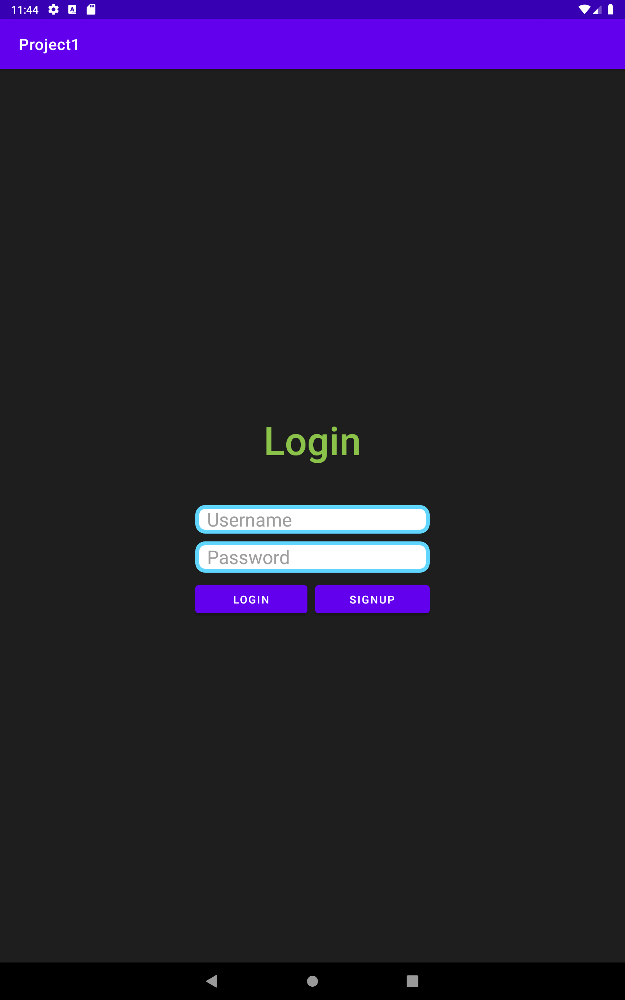
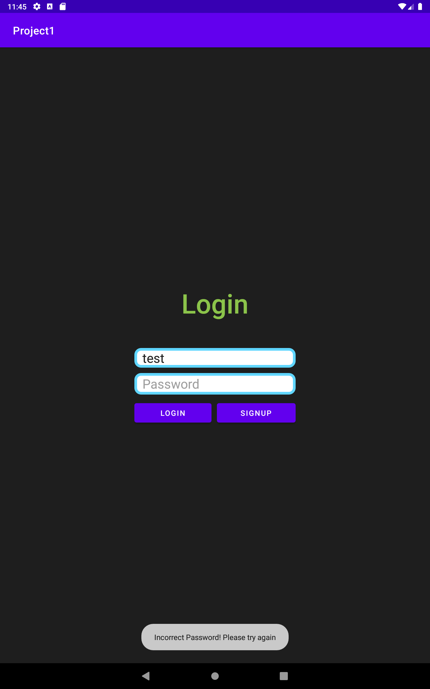
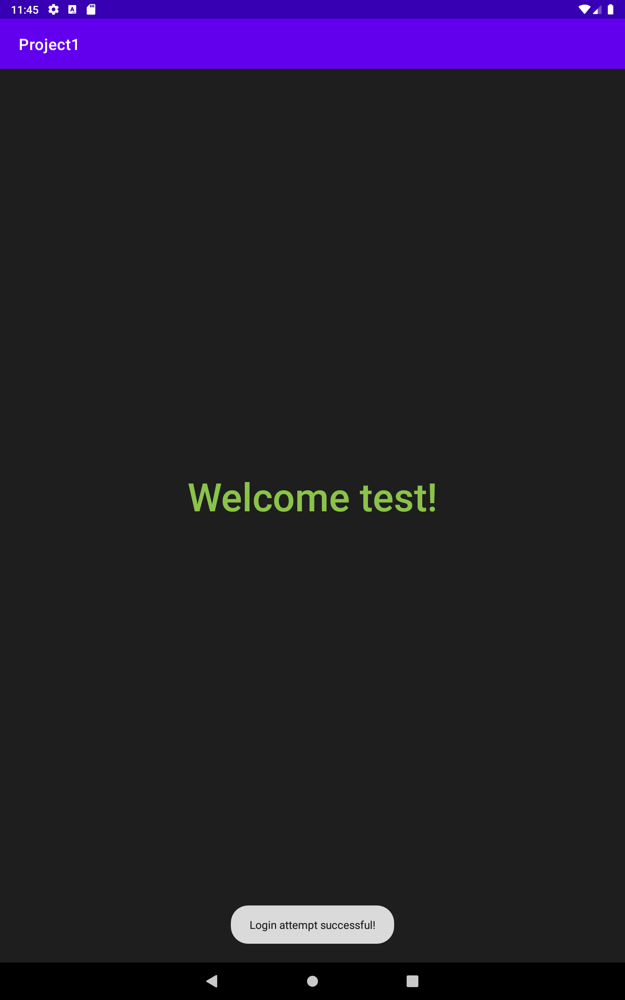
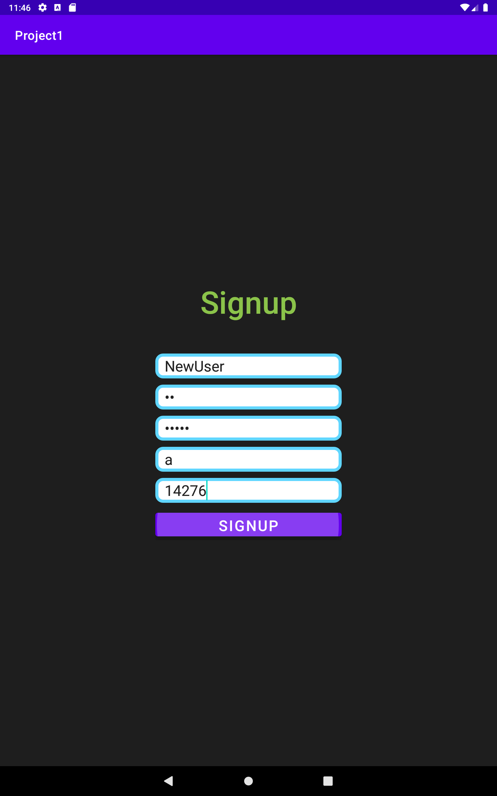
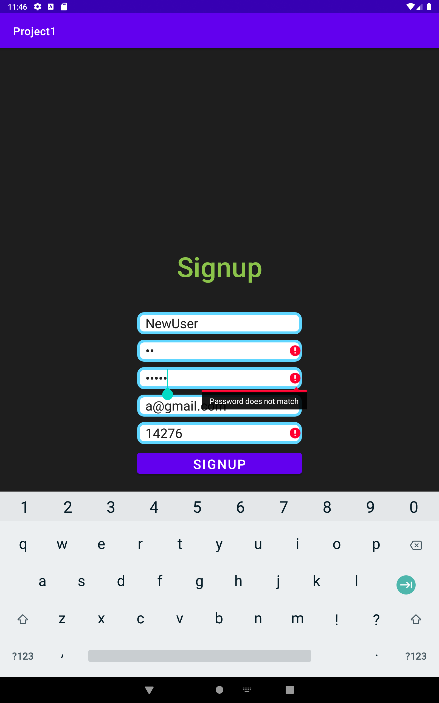

# A simple login and signup mobile application

## This project contains three activities:
1. A Login activity
 

  

 

* Inform user when incorrect credentials are entered
 

  

 

* Go to welcome page after successful login
 

  

 

2. A Signup activity
 

  

 

* Notify user if conditions for password, email and phone number are not met
 

  

 

* After registration, new user can login with credentials they provided during signup
 

  

 

3. A Welcome activity
* Displays a welcome message to currently logged in user
 

  

 

### Third-party library used for validation:  
* [AwesomeValidation](https://github.com/thyrlian/AwesomeValidation)